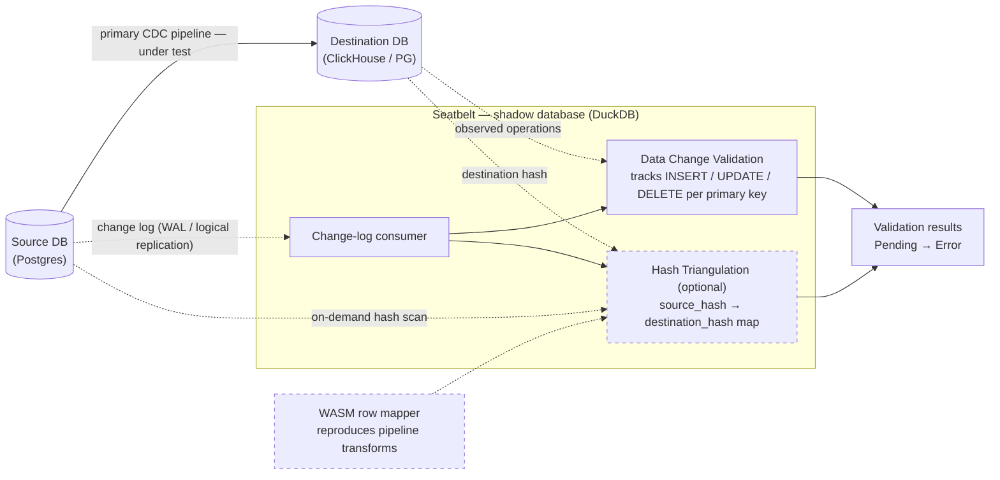

# Seatbelt

**End-to-end validation for live, high-throughput CDC pipelines.**

[](./LICENSE)

Seatbelt continuously verifies that a change-data-capture pipeline is actually moving your data
correctly. It verifies every row and column with no noise from false-positive alerts, while the source
keeps changing, and without hammering the source database.

---

## Why end-to-end data validation is hard

Most teams "validate" a pipeline by spot-checking row counts or sampling a few rows, because doing it
properly runs into a wall of problems:

- **Limited coverage:** count checks and sampling miss failures that matter, such as: a dropped update
  on one row, a value silently mangled by a type conversion, a handful of phantom rows. You only catch
  what you happen to look at.
- **Slow and resource-hungry on the source:** a real full-table comparison re-reads the entire source
  table, competing with production traffic on the database you least want to load. It usually only
  gets run infrequently or when someone reports a problem.
- **Noisy:** on a live pipeline the source is always changing and the destination lags behind.
  A point-in-time comparison constantly reports "mismatches" that are really just replication lag and
  resolve themselves moments later. This leads to alert fatigue on your team and they miss actual
  problems. 
- **Complex and configuration-heavy:** per-table, per-column rules; allowlists for which columns to
  compare; special cases for every type. The validator becomes its own pipeline to maintain.
- **Can't survive transformations:** you can't just hash both sides and compare. JSON re-serializes
  with different key ordering, floats truncate, timestamps lose precision, integers widen or become
  strings. This is why `source_hash == destination_hash` is false even when the data is perfectly correct.

The last two problems compound on a live pipeline: the data is being reshaped in flight _and_ the
source keeps moving, so by the time you've read it, it has already changed. Seatbelt starts from the
premise that a clean row-for-row comparison between source and destination is never available; and
then asks whether you can comprehensively test a live pipeline anyway. You can.

## How Seatbelt works

Seatbelt does its reconciliation in an embedded shadow database that sits beside the
pipeline. Per primary key, the shadow tracks the latest source and destination signatures and the
operation each side has seen. Two ideas make this work on live data:

1. **Data Change Validation:** without verifying the underlying data values, we can use the signatures
   to determine how the row is changing at the source to identify in-flight data and ensure the
   destination (eventaully) changed with a matching operation.
2. **Hash Triangulation:** rather than expecting a source hash to equal a destination hash (impossible
   once the pipeline transforms the data) the source and destination keep separate hash domains that
   are reconciled through a map built in the change log consumer.

By default the shadow database stays cheap: it builds its picture of the source from the source's
change log (logical replication / WAL) and verifies that picture against the destination. It only
reads the source table directly when it needs to (on a schedule or on demand) so the steady-state
load on the source is a continuous tail of the change stream rather than repeated full scans.



Solid arrows are the pipeline under test; dashed arrows are what Seatbelt observes. **Data Change
Validation** runs off the change stream alone and needs no value comparison; **Hash Triangulation** is
the optional, dashed-bordered layer that adds a full per-column audit, pulling an on-demand source hash
scan and a WASM row mapper into the picture.

### Data Change Validation — handle live, in-flight changes

Instead of comparing values, Seatbelt watches how data **moves**. Every INSERT / UPDATE / DELETE on a
source row should produce an equivalent operation on the corresponding destination row — regardless of
what the values are or how they were transformed. From that one invariant, with **zero** per-table or
per-column configuration, Seatbelt asserts:

- No source rows missing from the destination, and no destination rows missing from the source
- Row counts match, once replication lag is accounted for
- Every DML operation on a source row produced an equivalent operation on the destination — catching
  dropped updates, missing rows, phantom rows, duplicates, and un-replicated deletes

The trick to surviving live data is **two cycles**. A single snapshot can't tell "this row is
permanently wrong" apart from "this change just hasn't arrived yet." So a discrepancy first surfaces as
**Pending**, and is only promoted to an **Error** once Seatbelt has watched the row *settle*: it
changed on the source, and then — a beat later — changed equivalently on the destination. Between two
Seatbelt checks the **primary pipeline must catch up** and propagate those in-flight changes; the
second cycle is what proves a Pending discrepancy was just lag (now reconciled) or a genuine failure
(still unreconciled). This is why a live change stream matters — a one-shot batch run can flag Pending
rows but can't confirm Errors on its own.

The operation model and the exact failure-detection rules live in
[`change-validation-core/`](./change-validation-core) as an executable reference spec that the Go
program and the DuckDB extension both implement.

### Hash Triangulation — a full audit that survives transformations

Data Change Validation proves operations match, but not that every *value* in every *column* matches.
A full audit normally means hashing both sides and comparing — which, as above, breaks the moment the
pipeline transforms anything. Hash Triangulation solves exactly those tricky cases.

Rather than expecting `source_hash == destination_hash`, Seatbelt builds a map of
`source_hash → destination_hash` for every row, computed **asynchronously from the source change log**,
where the pipeline's transformation can be reproduced once, in one place. Then:

1. Use Data Change Validation to isolate the **static** rows (filtering out live churn and anything
   already flagged).
2. Compute a cheap **source hash** with the fastest native function on the source
   (e.g., in Postgres, `hashtextextended`) — minimal load, just one hash per row crossing the wire — and a deterministic
   **destination hash**.
3. From the change log, maintain the `source_hash → destination_hash` map.
4. Compare each row's observed `(source_hash, destination_hash)` pair against the map. A mismatch is a
   validation failure.

Because the map is derived from the change log, it absorbs **every** legitimate transformation — JSON
re-serialization, lossy type conversions, widening, precision changes — so the two hash domains never
need to be equal. The price is a **row mapper** that reproduces how the pipeline transforms rows.
Mappers compile to WebAssembly, so you can write one in any language without rebuilding Seatbelt —
see [`wasm-mappers/`](./wasm-mappers).

## Repository layout

| Path | What it is |
|------|------------|
| [`seatbelt/`](./seatbelt) | Core Go program. Source hashing via Postgres `hashtextextended`, a logical-replication consumer, and DuckDB-based triangulation. |
| [`duckdb-seatbelt-extension/`](./duckdb-seatbelt-extension) | DuckDB extension exposing the data-change-validation functions as SQL. |
| [`wasm-mappers/`](./wasm-mappers) | Language-agnostic WASM row-mapper ABI + a Zig reference mapper for PeerDB → ClickHouse. |
| [`change-validation-core/`](./change-validation-core) | Executable reference spec (Python) for the validation logic, with a cross-language conformance suite. |
| [`examples/`](./examples) | Self-contained, `docker compose`-based examples (see below). |
| [`docs/`](./docs) | Concept and setup guides. |
| [`benchmarks/`](./benchmarks) | Source-impact + throughput benchmarks (with a reproducible harness). |

## Quick start

Start with the simplest example — MySQL → Postgres via Sling — which runs entirely in Docker:

```bash
cd examples/sling-mysql-to-pg
./run.sh
```

Then try the Postgres → ClickHouse via PeerDB example, which exercises Hash Triangulation through the
WASM row mapper:

```bash
cd examples/peerdb-pg-to-clickhouse
./run.sh
```

Each example's `README.md` has the full walkthrough and the expected output.

## Benchmarks

Hash Triangulation allows us to choose source hash functions for efficiency instead of needing a
universal like MD5. In Postgres we can use the non-cryptographic, internal `hashtextextended` to
perform very fast verification scans with tiny network transfer:

| Table | Size | Transferred from source | % of table | Wall time |
|-------|------|-------------------------|-----------|-----------|
| 1 GB   | 1.0 GB | 33 MB  | **3.14 %** | 1 s |
| 10 GB  | 10 GB  | 323 MB | **3.14 %** | 8 s |
| 100 GB | 103 GB | 3.3 GB | **3.19 %** | 247 s |

Full methodology and a reproducible harness in [`benchmarks/`](./benchmarks).

## Documentation

- [Concepts](./docs/01-concepts.md) — Data Change Validation & Hash Triangulation in depth
- [Architecture](./docs/02-architecture.md) — how the Go tool actually works
- [Setup with Sling](./docs/03-setup-sling.md) — MySQL → Postgres walkthrough
- [Setup with PeerDB](./docs/04-setup-peerdb.md) — Postgres → ClickHouse, incl. writing a custom mapper

## Known limitations

This is a research-grade tool shared for its ideas, not a turnkey product:

- **Single-column integer primary keys** only (compound-PK support is a TODO).
- First-class pipelines are **PeerDB (PG → ClickHouse)** and **Sling (MySQL → PG)**; other pipelines
  need a row mapper.
- Operational concerns (HA, retries, packaging) are intentionally minimal.

## Background

There's a longer write-up of the motivation and a relevant
[r/dataengineering discussion](https://www.reddit.com/r/dataengineering/comments/1e9txka/data_pipeline_testing_howwhat_do_you_guys_do/)
on how teams test data pipelines today.

## License

MIT — see [LICENSE](./LICENSE).
